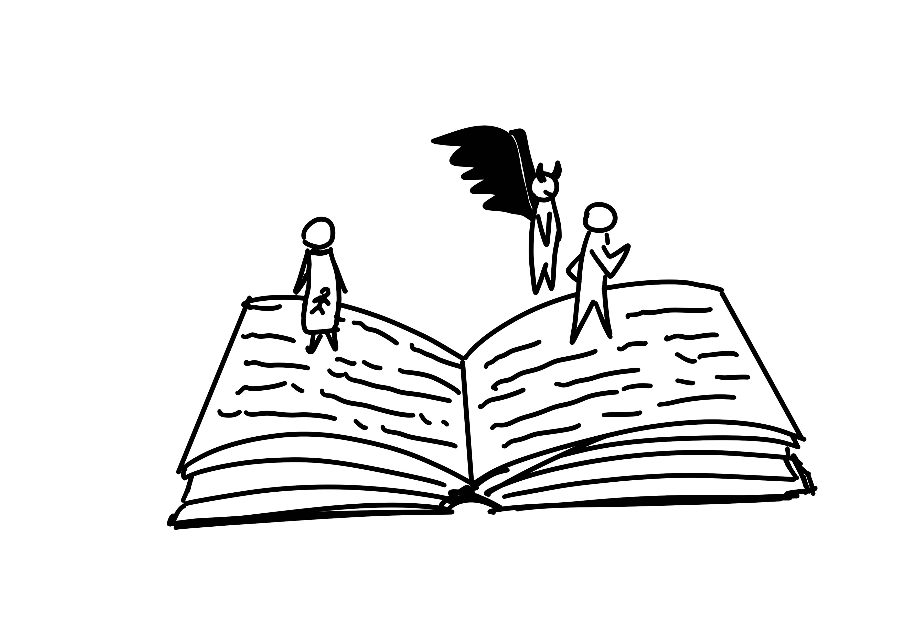

+++
title = "Abstract zu Faust"
date = "2023-05-02"
draft = true
pinned = false
tags = ["Faust", "Deutsch", "Literatur", "Literaturgeschichte"]
description = "Im Text von Kindlers Literatur Lexikon «Johann Wolfgang von Goethe – Faust», geschrieben von Ulrike Landfester, geht es um das Tragödien-Projekt Faust von Johann Wolfgang von Goethe. Dabei geht es sowohl um die Entstehung so wie auch die Verbreitung der Tragödie. "
footnotes = "**Quelle:**\n\n*«Johann Wolfgang von Goethe – Faust»* aus Munzinger Online/Kindlers Literatur Lexikon*,* <https://online.munzinger.de/article/22000241600_120> (abgerufen am 03.02.2023)"
+++

Die Geschichte handelt um den Gelernten Faust, welcher viel erreicht hat in seiner wissenschaftlichen Karriere. Obwohl er so viel erreicht hat, sehnt sich Faust nach Veränderung, nach Freiheit und Freude. Als Mephisto auftaucht, nützt dieser Fausts unglückliche Gefühle aus und schliesst einen Pakt mit ihm. Mephisto hilft Faust mit seinen Plänen und im Gegenzug überlässt Faust sein Leben nach dem Tod Mephisto.

Faust verliebt sich in das Mädchen Gretchen und möchte mit ihr schlafen. Das sie dies ungestört tun können, organisiert Mephisto für Faust einen Schlafmittel. Statt das die Mutter einfach nur einschläft, stirbt sie. 

Das geschwängerte Gretchen tötet nach der Geburt ihr Kind und wird wegen Kindsmord hingerichtet. Bei dieser Erzählung, greift Goethe auf seine Erfahrungen von der Hinrichtung von Susanne Margarethe Brandt 1772 zurück. 

Die Schuld der beiden, Faust und Gretchen, wird zwar anerkannt doch sehr unterschiedlich bewertet. Bis heute gibt es verschiedene Deutungsansätze zu Faust. «Ist er gut oder böse?», «Gibt es ein klares gut oder böse, oder gibt es noch etwas in der Mitte?». Faust zeigt einen menschliches Scheitern in einer zugleich faszinierende poetischen Dimension. 

Entweder zeigt Goethe mit Faust das Scheitern menschlicher Grösse oder die humanitätsfremde Perfektion in der Gesellschaft. Auch bei dem Charakter Faust gehen die Meinungen von Wahnsinnigen bis «zum Inbegriff moderner Subjektivität auf verzweifelter Identitätssuche» .

Zwar ist der Inhalt von Goethe sehr kontrovers, jedoch ist Faust sprachlich unumstritten ein Meisterwerk. Goethe schreibt in einer Vielfalt von Reimschemen und Metrik.

Faust gehört zu den wichtigsten Stücken der Deutschen Literaturgeschichte, ob man es mag oder nicht. Faust gibt einen Einblick in die damaligen Problematiken, die zum Teil auch heute noch grosse Probleme auf werfen, in einer vielfältigen Sprache.